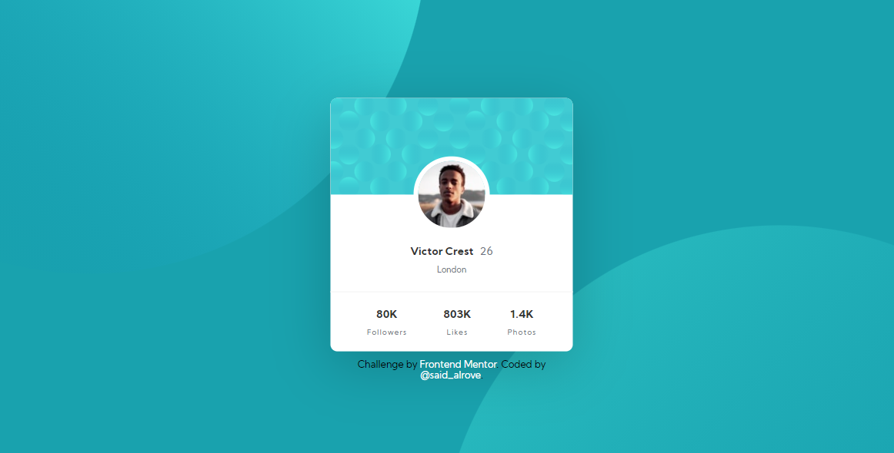

# Frontend Mentor - Profile card component solution
This is a solution to the [Profile card component](https://www.frontendmentor.io/challenges/profile-card-component-cfArpWshJ/hub/profile-card-component-V_W91T3Q5). Frontend Mentor challenges help you improve your coding skills by building realistic projects. 

> **Note:** in order to avoid large names, the URL of this project is an abbreviation of the name of this repository (profile-card-component -> pcc) with its unique ID (for less problems with names already taken).

## Screenshot

## Links

- [Frontend Mentor](https://www.frontendmentor.io/solutions/profile-card-component-using-flexbox-and-position-A_OgSM9LR)
- [Netlify](https://pcc-129222.netlify.app/)

## Author

- Frontend Mentor - [@said-alrove](https://www.frontendmentor.io/profile/said-alrove)
- Twitter - [@said_alrove](https://twitter.com/said_alrove)
